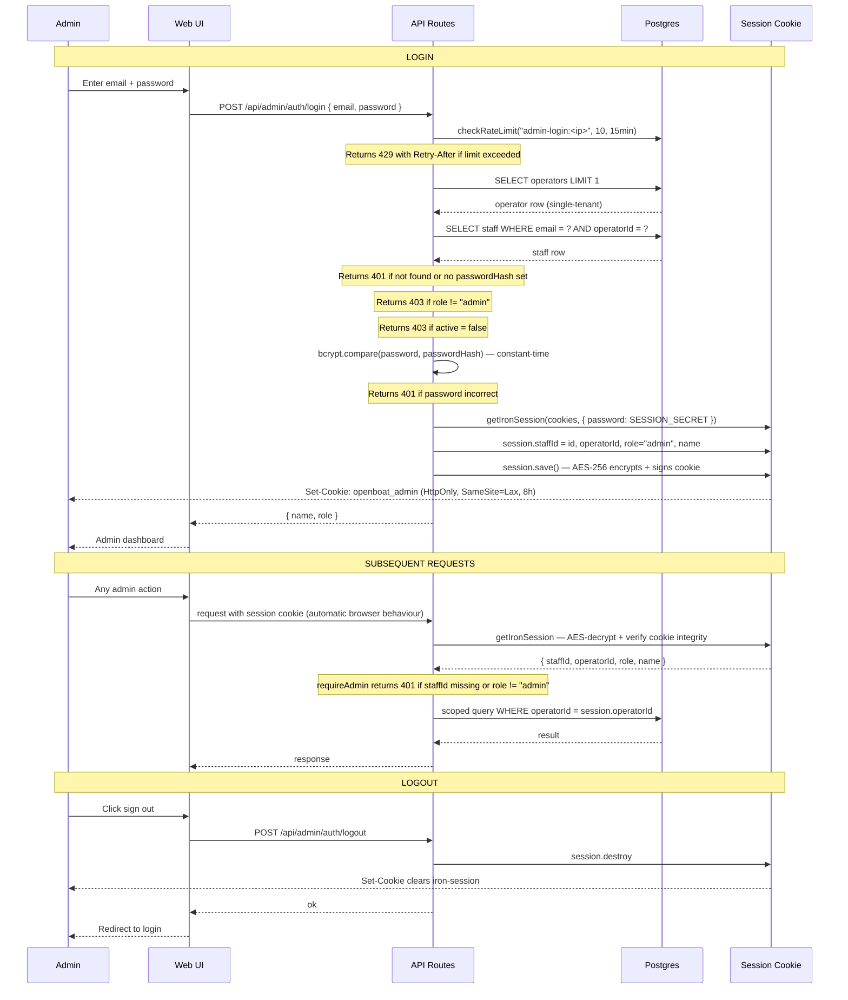

# Admin Auth Flow — Sequence Diagram

## How this differs from mate auth

|                  | Admin                                     | Mate                            |
| ---------------- | ----------------------------------------- | ------------------------------- |
| Credential       | Email + password                          | Email + PIN                     |
| Session storage  | iron-session encrypted cookie             | HMAC-signed JWT (Bearer header) |
| Session lifetime | Cookie expiry (browser session)           | Token lifetime in payload       |
| Role required    | `admin` only                              | `mate` or `admin`               |
| Stateless        | No — server reads cookie on every request | Yes — JWT self-contained        |

## Key invariants

| Invariant                               | Where enforced                                                   |
| --------------------------------------- | ---------------------------------------------------------------- |
| Password never stored in plaintext      | bcrypt hash stored in `staff.passwordHash`                       |
| Session tamper-proof                    | iron-session AES-256 encrypts + signs with `SESSION_SECRET`      |
| All admin queries are operator-scoped   | `requireAdmin` returns `session.operatorId`; every query uses it |
| Role checked at login, not just session | `role !== "admin"` check before session is written               |
| Brute-force protected                   | 10 login attempts/15min per IP; returns 429 with Retry-After     |
