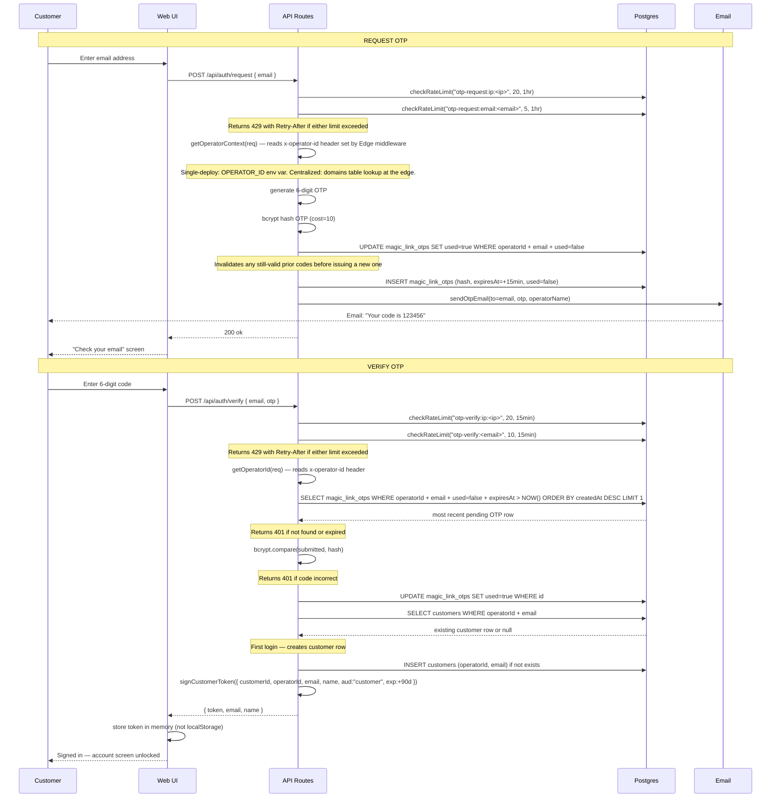

# Customer Auth Flow — Sequence Diagram

## Key invariants

| Invariant                     | Where enforced                                                            |
| ----------------------------- | ------------------------------------------------------------------------- |
| OTP never stored in plaintext | bcrypt hashed at cost=10 before INSERT                                    |
| OTP expires after 15 minutes  | `expiresAt > NOW()` checked in SELECT WHERE clause                        |
| OTP single-use                | `used=true` set immediately on successful verify                          |
| Old codes hard-invalidated     | Requesting a new OTP sets `used=true` on all prior unused codes for that email — not just superseded by `ORDER BY` |
| Customer row is upsert-safe   | SELECT then INSERT only if not found — no unique constraint race          |
| Auth is stateless             | HMAC-signed token; no server-side session table                           |
| Token audience separation     | `aud:"customer"` embedded and verified — mate tokens rejected             |
| Operator resolved from Edge middleware | `getOperatorContext`/`getOperatorId` read `x-operator-id` header — never DB `LIMIT 1` or request body |
| Brute-force protected         | Request: 20/hr per IP + 5/hr per email. Verify: 20/15min per IP + 10/15min per email |
