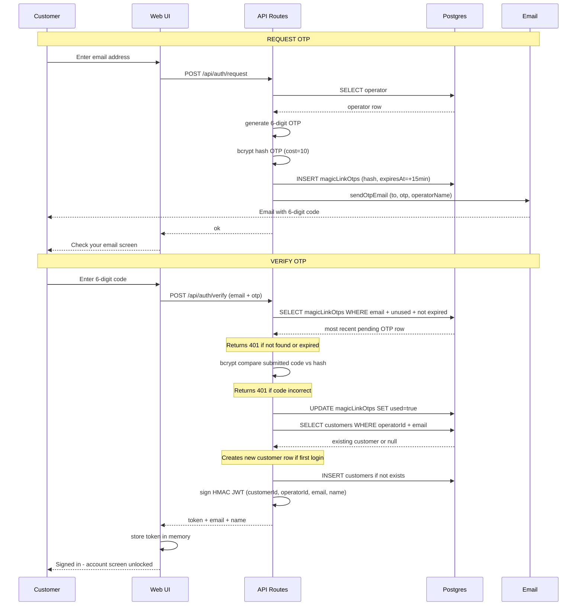

# Customer Auth Flow — Sequence Diagram

## Key invariants

| Invariant | Where enforced |
|---|---|
| OTP never stored in plaintext | bcrypt hashed at cost=10 before INSERT |
| OTP expires after 15 minutes | `expiresAt` checked in SELECT WHERE clause |
| OTP single-use | `used=true` set immediately on successful verify |
| Most recent code wins | `ORDER BY createdAt DESC LIMIT 1` — re-requesting invalidates older codes |
| Customer row is upsert-safe | SELECT then INSERT only if not found — no unique constraint race |
| Auth is stateless | HMAC-signed JWT; no server-side session table |
