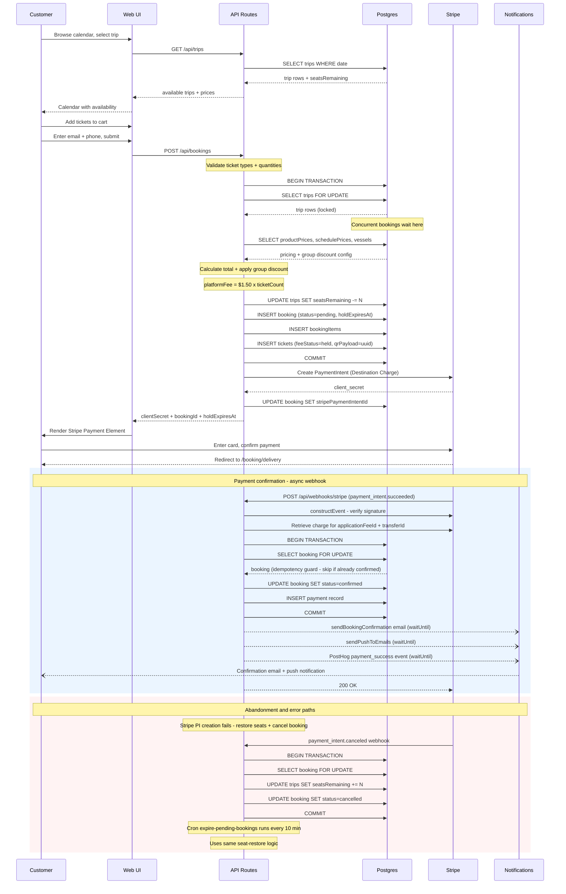

# Booking Flow — Sequence Diagram

## Key invariants

| Invariant | Where enforced |
|---|---|
| Seats never double-sold | `SELECT … FOR UPDATE` inside the booking transaction |
| Duplicate webhook delivery is safe | `FOR UPDATE` re-check before confirming; skips if already `confirmed` |
| Ghost holds don't accumulate | Seats restored on PI creation failure and on `payment_intent.canceled` |
| Platform fee captured atomically | `application_fee_amount` set at PI creation, not separately |
| Background tasks don't block Stripe ACK | `waitUntil` keeps function alive after `200 OK` returns |
