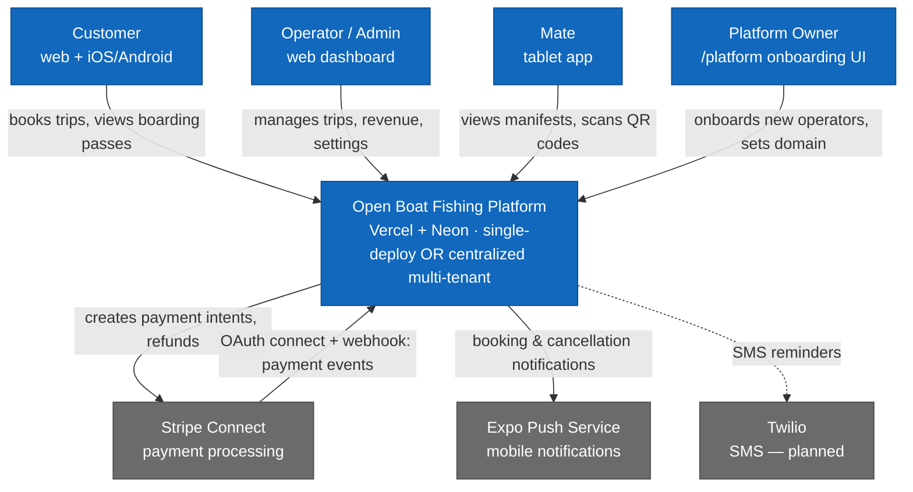
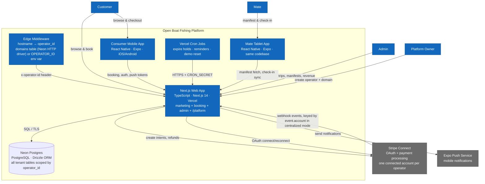

# Architecture Diagrams

Two levels: **Context** (who uses the system and what it talks to) and **Container** (how the technical pieces fit together).

---

## Level 1 — System Context

Two deployment models, same codebase (see `centralized-architecture.md` for the full breakdown):

- **Single-deploy (enterprise/white-label):** one Vercel + Neon instance per operator. `OPERATOR_ID` env var short-circuits operator resolution.
- **Centralized (platform mode):** one shared Vercel + Neon instance, many operators, hostname → `operator_id` resolved per-request via the `domains` table. New operators onboard through `/platform` (Platform Owner persona above), gated by `PLATFORM_SECRET`.

---

## Level 2 — Container

Every inbound request to `web` first passes through `mw` (`apps/web/src/middleware.ts`), which resolves `operator_id` before any route handler runs — API routes read it via `getOperatorId(req)`/`getOperatorContext(req)` (`src/lib/operator.ts`), server components via `getOperatorIdFromHeaders()`. No route does its own `SELECT operators LIMIT 1` or trusts a client-supplied operator ID.

---

## Key Architecture Decisions

| Decision | What and Why |
|---|---|
| **Single-deploy and centralized coexist** | Same codebase serves both. `OPERATOR_ID` env var short-circuits Edge middleware for per-operator deployments; unset, it resolves hostname → `operator_id` via the `domains` table. Zero-downtime, backwards-compatible migration path. |
| **No separate API server** | All backend logic is Next.js API routes deployed as Vercel serverless functions. Eliminates a separate service to maintain and deploy. |
| **Stripe Connect destination charges, OAuth-linked per operator** | Funds route directly to the operator's connected Stripe account at charge time. Platform fee (`application_fee_amount: $1.50`) is deducted automatically. `stripeAccountId` is stored per-operator and linked via an OAuth flow (`/api/stripe/connect/start` → `/callback`), not a single shared env var. |
| **Same Expo codebase for two apps** | Consumer and mate apps share one codebase. `EXPO_PUBLIC_APP_VARIANT=mate` switches which screens are mounted. Avoids duplicating shared components. |
| **Seats locked with `FOR UPDATE SKIP LOCKED`** | Prevents double-booking without application-level counters. The DB holds the truth; no Redis or external lock needed. |
| **Email OTP auth for customers, PIN for mates** | Customers authenticate via 6-digit email codes. Mates use short PINs on a shared tablet where typing a full password is impractical. Both are Postgres-backed rate-limited and operator-scoped. |
| **Offline SQLite wallet in consumer app** | Boarding passes survive airplane mode. Tickets sync to local SQLite at confirmation. |
| **Trip rows materialized at schedule save** | Schedules are patterns; individual `trips` rows are written immediately. Keeps the booking calendar query simple. |
| **Operator ID never trusted from the client** | Edge middleware resolves it once per request and injects `x-operator-id`; every API route and server component reads it from there — never from request body, query string, or a per-route DB `LIMIT 1`. |
