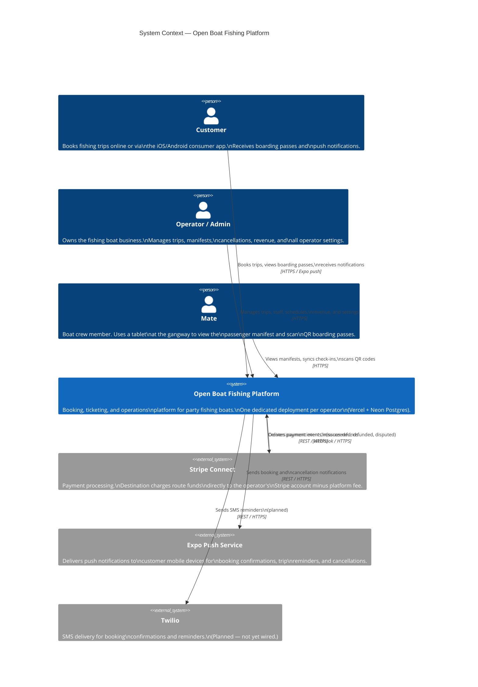
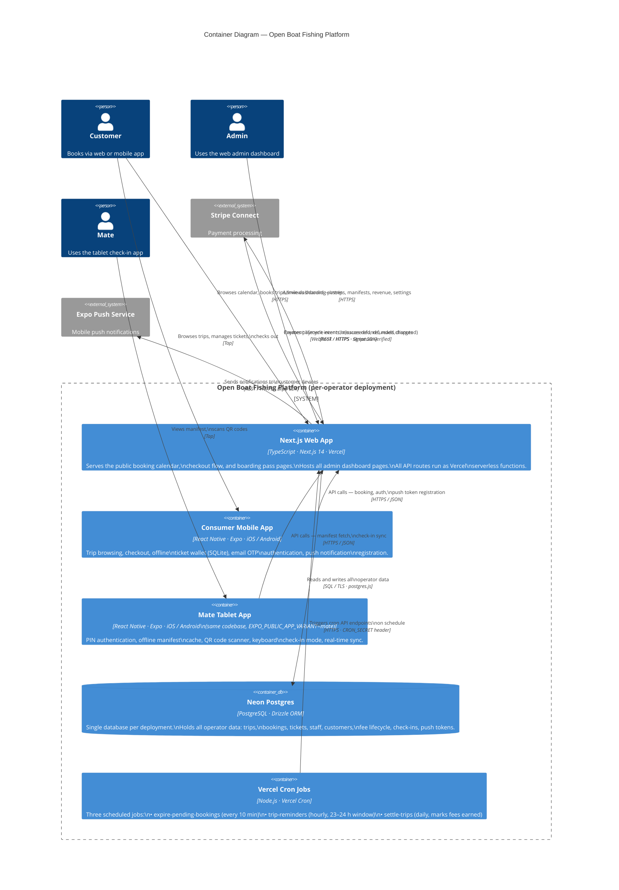

# C4 Architecture Diagrams

Two levels: **Context** (who uses the system and what it talks to) and **Container** (how the technical pieces fit together). Level 3 (Component) and Level 4 (Code) are omitted — too granular to justify maintenance at this project size.

---

## Level 1 — System Context

Who uses the platform and what external systems does it depend on.

---

## Level 2 — Container

The internal technical building blocks and how they communicate.

---

## Key Architecture Decisions

These are the non-obvious choices that the diagrams don't fully convey:

| Decision | What and Why |
|---|---|
| **One deployment per operator** | No shared infrastructure. Onboard a new client by forking the repo and deploying a fresh Vercel + Neon instance. Simple ops, no cross-tenant data risk. |
| **No separate API server** | All backend logic is Next.js API routes deployed as Vercel serverless functions. Eliminates a separate service to maintain and deploy. |
| **Stripe Connect destination charges** | Funds route directly to the operator's Stripe account at charge time. Platform fee (`application_fee_amount: $1.50`) is deducted automatically. No payout logic needed. |
| **Same Expo codebase for two apps** | Consumer and mate apps share one codebase. `EXPO_PUBLIC_APP_VARIANT=mate` switches which screens are mounted. Avoids duplicating shared components (manifest, QR). |
| **Seats locked with `FOR UPDATE SKIP LOCKED`** | Prevents double-booking without application-level counters. The DB holds the truth; no Redis or external lock needed. |
| **Email OTP auth for customers, PIN for mates** | Customers authenticate via 6-digit email codes (no password to forget or reset). Mates use short PINs on a shared tablet where typing a full password is impractical. |
| **Offline SQLite wallet in consumer app** | Boarding passes survive airplane mode. Tickets sync to local SQLite at confirmation; the mate app validates QR content without a network call. |
| **Trip rows materialized at schedule save** | Schedules are patterns; individual `trips` rows are written immediately when a schedule is created. This keeps the booking calendar query simple (`SELECT * FROM trips WHERE date >= today`). |
