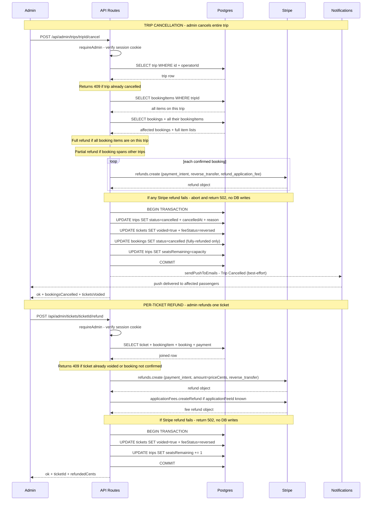

# Cancellation Flow — Sequence Diagram

## Key invariants

| Invariant | Where enforced |
|---|---|
| Stripe refunds always run before DB changes | All `stripe.refunds.create` calls complete before the transaction opens |
| Cancellation aborts if any refund fails | 502 returned immediately; no DB writes made |
| Fee always reversed with the refund | `refund_application_fee: true` or explicit `applicationFees.createRefund` |
| Seats restored on per-ticket refund | `seatsRemaining += 1` inside the same transaction |
| Seats reset to full capacity on trip cancel | `seatsRemaining = capacity` — trip is dead, no new bookings possible |
| Multi-trip bookings get partial refund only | Refund scoped to `subtotalCents` of items on the cancelled trip |
| Push notifications are non-blocking | Fire-and-forget after the response is ready |
