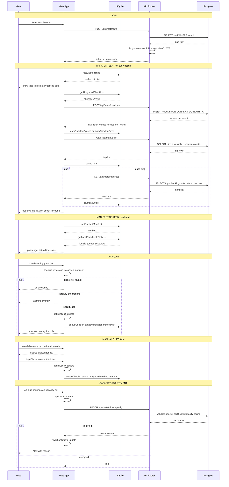

# Check-in Flow — Sequence Diagram

## Key invariants

| Invariant                          | Where enforced                                                     |
| ---------------------------------- | ------------------------------------------------------------------ |
| Works fully offline                | All check-ins write to SQLite first; network is best-effort        |
| No double check-in                 | `ON CONFLICT DO NOTHING` on server; scanLocked for 1.5s on device  |
| Manifest always current on open    | syncAndRefresh flushes queue then re-fetches on every screen focus |
| Optimistic UI stays correct        | localCheckedIn merges server state and queued-but-unsynced events  |
| Capacity cannot exceed certificate | API enforces ceiling; optimistic update reverts on rejection       |
| Auth is stateless                  | HMAC-signed JWT verified on every request — no server session      |
