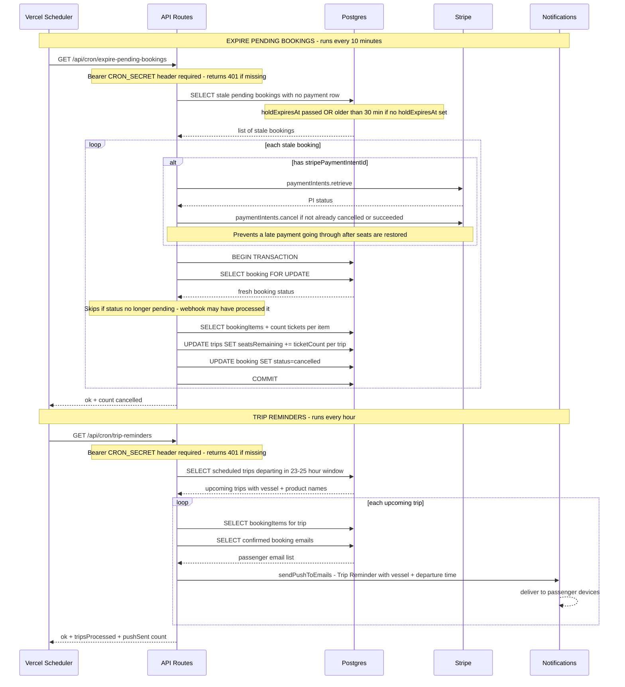

# Cron Job Flows — Sequence Diagram

## Key invariants

| Invariant | Where enforced |
|---|---|
| Cron endpoints require auth | `Bearer CRON_SECRET` header checked before any DB work |
| PI cancelled before seats restored | Stripe cancel runs outside transaction to prevent late payments |
| No double seat-restore | `SELECT FOR UPDATE` re-checks status — skips if webhook already handled it |
| Reminder window is exactly 23-25h | Hourly cron + 2h window = every trip gets exactly one reminder |
| Reminders only go to confirmed bookings | `WHERE status = confirmed` filters out pending and cancelled |
