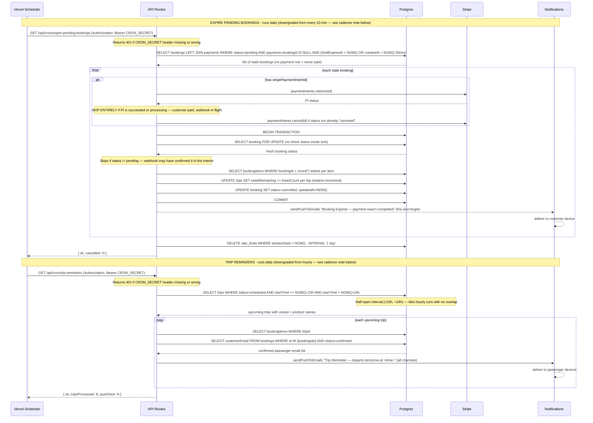

# Cron Job Flows — Sequence Diagram



## Cadence note (current known gap)

`apps/web/vercel.json` currently schedules both crons **daily**, not at the cadence the diagram's internal logic assumes:

```json
"crons": [
  { "path": "/api/cron/expire-pending-bookings", "schedule": "0 2 * * *" },
  { "path": "/api/cron/trip-reminders", "schedule": "0 9 * * *" }
]
```

This is a deliberate downgrade for the Vercel Hobby plan, which caps a project at 2 crons and once/day scheduling. The `[+23h, +24h)` reminder window and the "no double seat-restore" invariant both still hold at daily cadence — they just fire less often, so a hold can sit expired for up to ~24h before the cron clears it, and a trip reminder can land anywhere in that departure-minus-23-to-24-hour window rather than reliably near the top of the hour. See `CLAUDE.md` → "Known gaps blocking production": upgrading to Vercel Pro restores `*/10 * * * *` expiry and hourly reminders.

## Third cron: Reset Demo Data (not in vercel.json)

A third route, `GET /api/cron/reset-demo-data` (`apps/web/src/app/api/cron/reset-demo-data/route.ts`), exists for the `openboatfishing.com` demo deployment but is **not** registered in `vercel.json` — the Hobby plan's 2-cron cap is already used by the two crons above. It is guarded twice: `CRON_SECRET` (same as the other crons) and `DEMO_MODE=true` (returns 403 otherwise, as a safety net against accidentally wiping a real operator's data). When enabled, it wipes booking activity and restores seat inventory on all trips for the resolved operator via `resetBookingActivity()`, while preserving vessels, products, prices, schedules, staff, customers, and fishing reports. Until the project upgrades to Vercel Pro (which allows more crons), this route must be triggered manually or via an external scheduler if the nightly reset is needed.

## Key invariants

| Invariant                                  | Where enforced                                                             |
| ------------------------------------------ | -------------------------------------------------------------------------- |
| Cron endpoints require auth                | `Bearer CRON_SECRET` header checked before any DB work                     |
| PI skip on succeeded/processing            | Cron checks PI status before cancelling — avoids racing a webhook in-flight |
| PI cancelled before seats restored         | Stripe cancel runs outside transaction to prevent late payments going through |
| No double seat-restore                     | `SELECT FOR UPDATE` re-checks status — skips if webhook already confirmed it |
| Customer notified on expiry                | Push sent after each successful cancellation (fire-and-forget)             |
| rate_limits table stays bounded            | Rows older than 1 day purged at end of each cron run                       |
| Reminder window is exactly [+23h, +24h)    | Half-open interval — hourly cron tiles runs with zero overlap              |
| Reminders only go to confirmed bookings    | `WHERE status = 'confirmed'` filters out pending and cancelled             |
