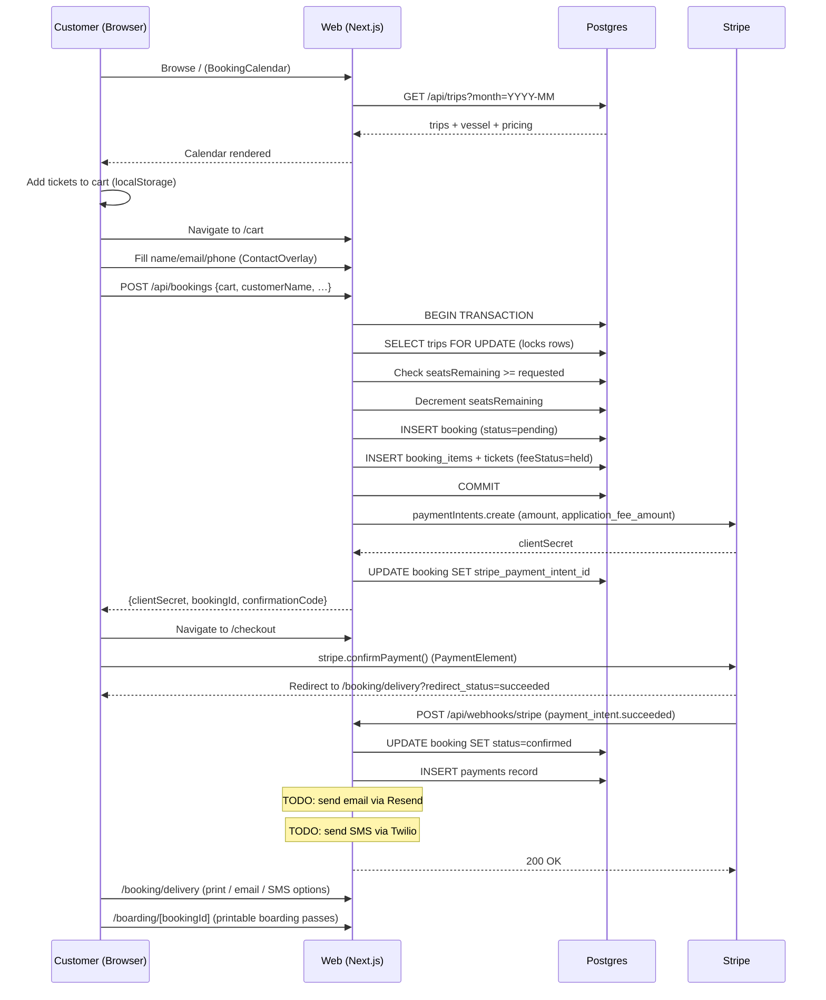
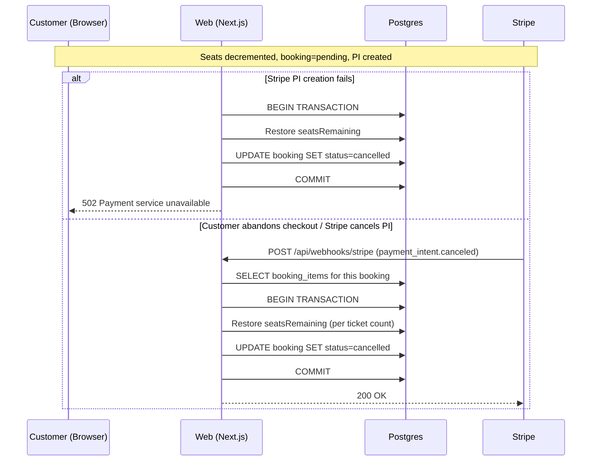
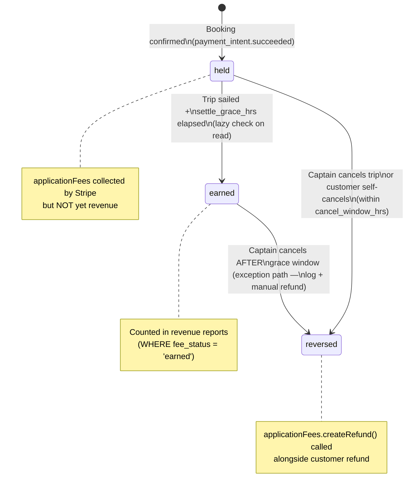
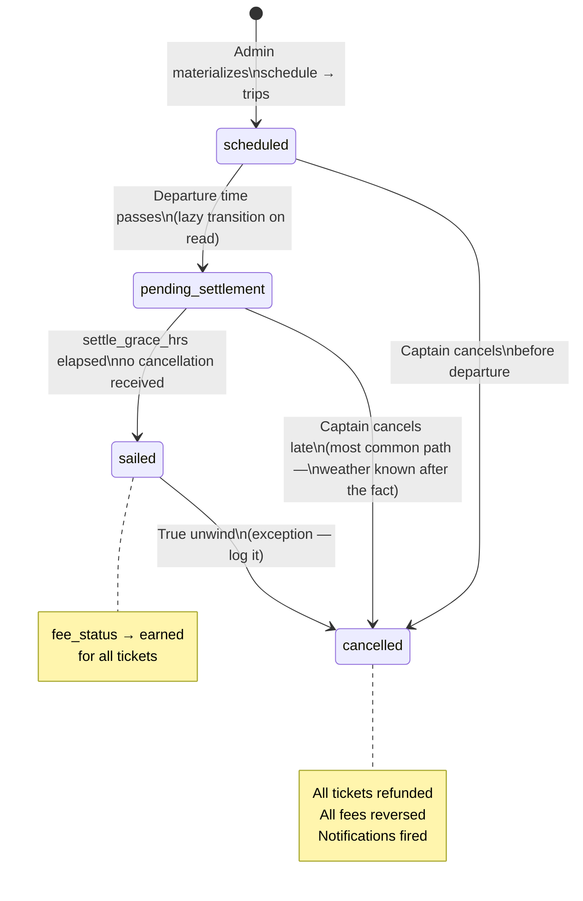

# System Flows

## Booking Lifecycle — Happy Path

---

## Booking Lifecycle — Payment Cancelled / Abandoned

---

## Fee Lifecycle

---

## Trip Status Lifecycle

---

## Webhook Event Coverage

| Event | Handler | Action |
|---|---|---|
| `payment_intent.succeeded` | ✅ | Confirm booking, record payment |
| `payment_intent.canceled` | ✅ | Restore seats, cancel booking |
| `payment_intent.payment_failed` | ❌ not handled | Customer can retry — no action needed |
| `application_fee.refunded` | ❌ not handled | Future: update fee_status → reversed |
| `charge.refunded` | ❌ not handled | Future: trigger for cancellation flow |
